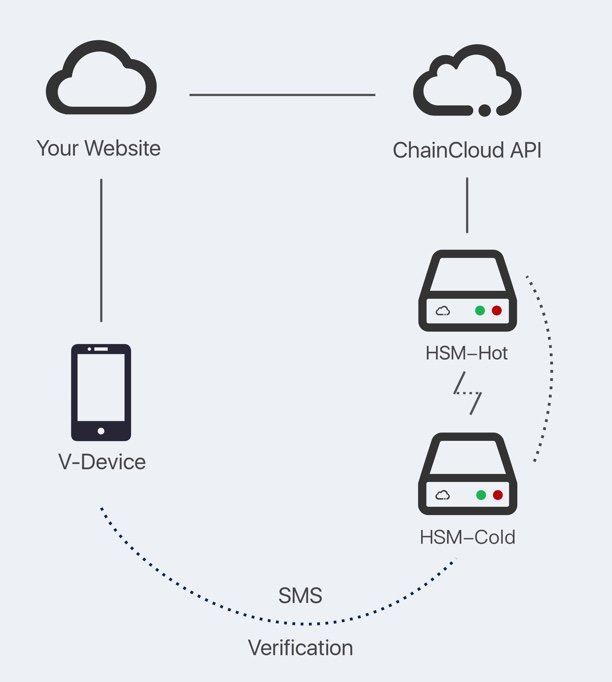

.. _architecture:

********************************************************************************
Architecture
********************************************************************************

Diagram
================================================================================

HSM
===============================================================================

HSM means Hardware Security Module. We have specially designed two HSM modules to construct unbreakable secured blockchain cloud platform:

* HSM-Hot

* HSM-Cold

